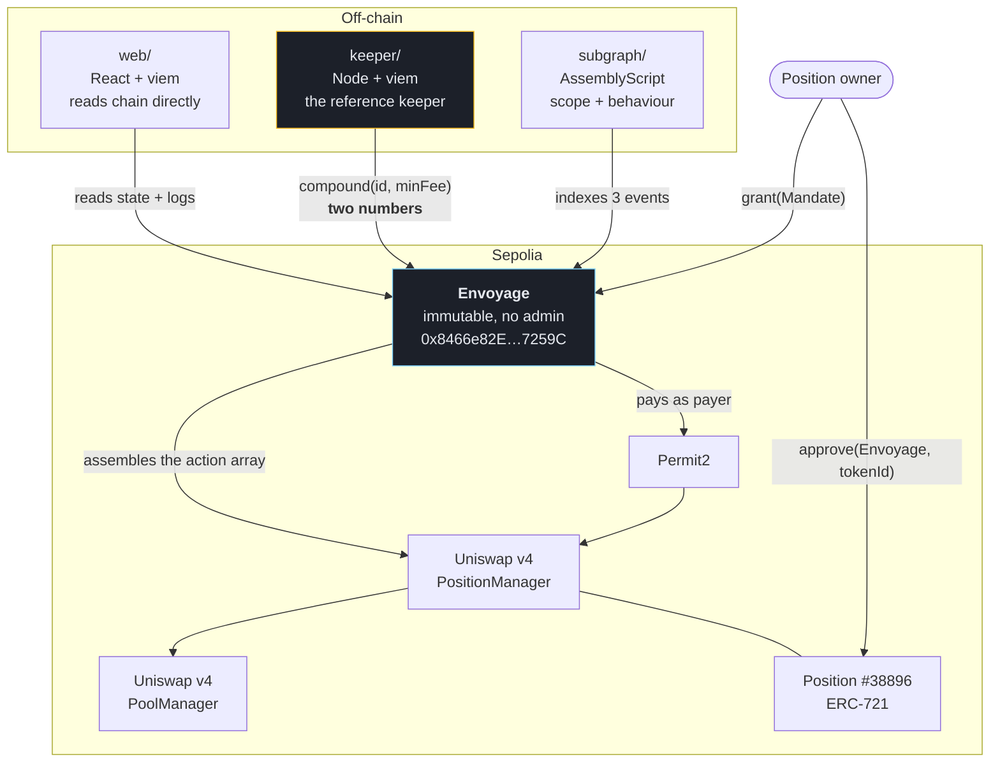
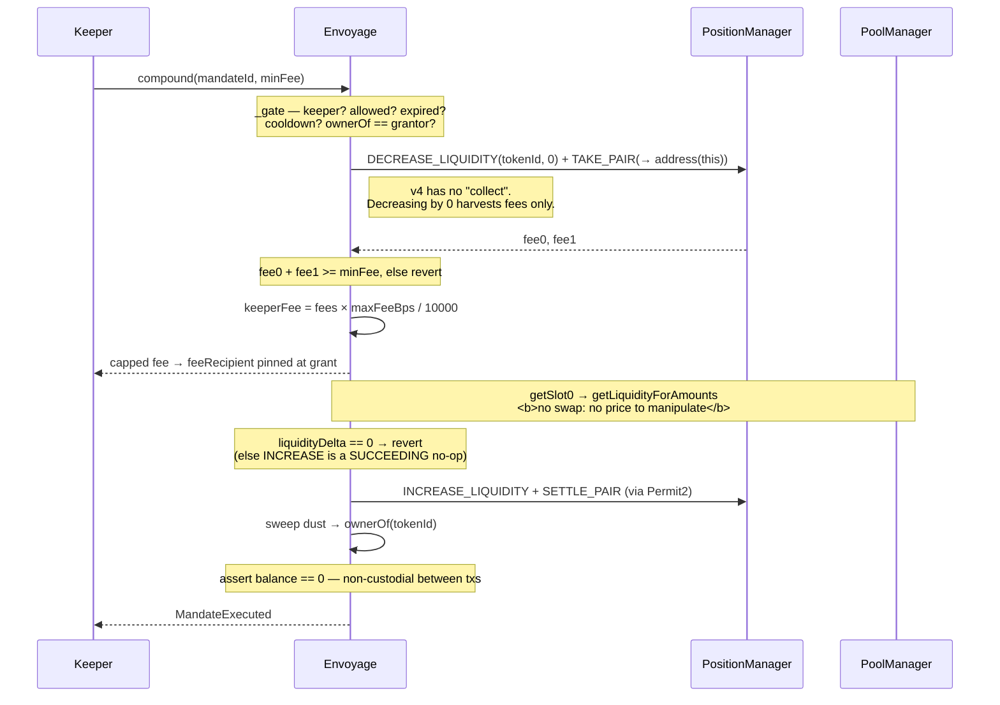
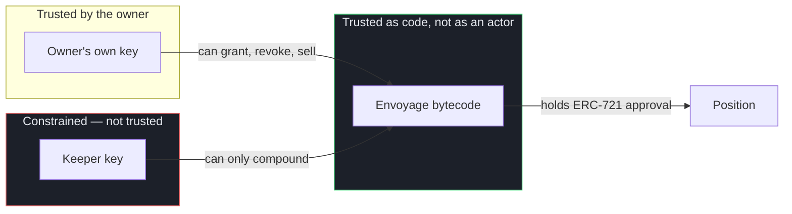
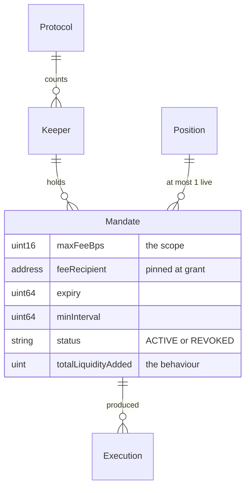

# Architecture

## The one-sentence version

A keeper never writes Uniswap v4 instructions. It calls a typed entrypoint with two
numbers; **Envoyage** assembles the action array itself, with the recipient as a
constant in code. Misuse is not rejected by a check — there is no channel in which to
express it.

---

## Why the shape is what it is

Uniswap v4 collapses liquidity management into one entrypoint,
`PositionManager.modifyLiquidities(bytes actions, uint256 deadline)`. That `bytes` is
an action array — a small language with 26 opcodes. This matters more than it looks:

> Restricting a keeper to "may only call `modifyLiquidities`" restricts nothing,
> because that function is itself an interpreter.

`docs/V4-ACTION-COMPLETENESS.md` traces all 26 to file and line. The finding that
determines this architecture:

| Actions taking a recipient **from the caller** | Consequence |
|---|---|
| `TAKE_PAIR` `0x11`, `TAKE` `0x0e`, `SWEEP` `0x14`, `MINT_POSITION` `0x02` | any of these can send value anywhere |

So `approve(keeper, tokenId)` is equivalent to handing over the position: the keeper
assembles `DECREASE_LIQUIDITY` + `TAKE_PAIR(…, its own wallet)` and nothing on chain
objects. That is the Code4rena Revert Lend H-04 class, and the shape behind the
Aperture Finance drain.

**The inversion.** The authority must exist somewhere — this was established
empirically, not assumed: the first integration spike failed with `NotApproved`,
proving `INCREASE_LIQUIDITY` rejects a caller without ERC-721 approval. The question
is therefore never *whether* someone holds it, but **who**. Envoyage holds it, and
Envoyage is code that cannot be told what to do with it.

---

## System



The keeper's only arrow into the system carries two integers. It has no arrow to
`PositionManager`, because it holds no approval there.

---

## The compound path



**Four v4 actions. Not one takes a recipient from the keeper.**

| Step | Action | Recipient |
|---|---|---|
| 1 | `DECREASE_LIQUIDITY(tokenId, 0)` | — harvests fees |
| 2 | `TAKE_PAIR` | `address(this)` **literal** |
| 3 | `INCREASE_LIQUIDITY` | — |
| 4 | `SETTLE_PAIR` | `msgSender()` = Envoyage |

> `ActionConstants.ADDRESS_THIS` means the **PositionManager**, not your contract.
> Passing it here would send every harvested fee to Uniswap's periphery.

**There is no swap leg**, for two independent reasons. `PositionManager` does not
dispatch swap actions at all (`test_spike_positionManagerRejectsSwapAction`), and
without a swap `compound` has no price — so no value can leak through one. Uniswap
reached a related conclusion itself, deprecating `INCREASE_LIQUIDITY_FROM_DELTAS` as
*"Vulnerable to sandwich attacks"*.

---

## Trust boundaries



Envoyage aggregates many owners' approvals, which makes it a more attractive target
than those approvals left scattered. The claim *"Envoyage takes no instructions"* is a
statement about **bytecode**, so it is asserted against the deployed artifact rather
than the source, in `test/unit/Immutability.t.sol`:

- no `DELEGATECALL` (`0xf4`), `SELFDESTRUCT` (`0xff`) or `CALLCODE` (`0xf2`)
- no arbitrary-call or admin selector resolves
- dependencies immutable in fact, not merely by keyword

The opcode scan skips `PUSH` immediates, so a constant containing `0xf4` is not
misread — and it carries a **negative control** that runs the same scanner over a
contract which does contain `DELEGATECALL`, because a scanner that finds nothing
proves nothing until you know it can find something.

What is **not** protected is listed explicitly in `docs/THREAT-MODEL.md`: a keeper
that simply does nothing, selective griefing via `minFee`, and bugs in Envoyage
itself. The claim is attack-surface reduction, not absolute security.

---

## Tech stack

### On-chain

| Choice | Version / pin | Why this one |
|---|---|---|
| **Solidity** | `0.8.26`, `cancun` | Required by v4; transient storage era |
| **Foundry** | forge `1.7.1` | Fuzzing and invariants are first-class, and the whole v4 test harness is Foundry-native |
| **v4-periphery** | `dce236d`, submodule | Pinned by SHA. `StateView` on Sepolia is **3531 bytes**, byte-for-byte our local compile — so the pin provably matches what Sepolia runs |
| **forge-std** | `452bdec`, submodule | — |
| **Permit2** | canonical | `PositionManager` pulls payment through Permit2 whenever the payer is not itself, and here the payer is Envoyage |

**Exactly two submodules.** `v4-core`, `permit2`, `openzeppelin` and `solmate` are
deliberately *not* installed standalone — v4-periphery vendors compatible versions and
the standalone ones are not compatible. A standalone `v4-core` is missing
`src/types/PoolOperation.sol` that v4-periphery's own test harness imports, and
OpenZeppelin 5.7.0 makes `TransparentUpgradeableProxy` revert with `0xc28a273c` where
v4 expects the vendored 5.0.2.

**Immutable by construction.** No proxy, no admin, no upgrade path. This is not a
shortcut taken for speed — it is simultaneously safer *and* faster to build: no
storage gaps, no initializer, no upgrade tests. If a bug is found, deploy a new
address and owners re-approve.

### Off-chain

| Component | Stack | Why |
|---|---|---|
| **web/** | React 18 · Vite 5 · **viem 2** · TypeScript 5.6 | No wagmi/RainbowKit: the page must render with no wallet connected. viem alone keeps the bundle at 132 kB gzipped |
| **keeper/** | Node 23 · viem 2 · tsx | Deliberately tiny. The bot is itself the argument — read it and see that `compound(id, minFee)` is the only state-changing call available |
| **subgraph/** | graph-cli `0.97.1` · graph-ts `0.38.0` · AssemblyScript · matchstick `0.6.0` | matchstick runs the real handlers against mocked events, so mapping logic is verified with no Studio key and no Graph node |
| **RPC** | publicnode + 1rpc, `fallback()` | **Two operators, not two endpoints from one.** Several keys from a single provider share one failure domain: when it rate-limits, all of them do together and the fallback never actually fails over |

### Testing

| Layer | File | What it establishes |
|---|---|---|
| Integration spike | `test/unit/Spike.t.sol` | The v4 flow is traversable with no swap — run *before* writing the contract |
| Unit | `test/unit/Envoyage.t.sol` | 16 gating and fee-accounting tests |
| Transfer semantics | `test/unit/Transfer.t.sol` | Tokens that return `false`, and tokens that return nothing |
| Bytecode | `test/unit/Immutability.t.sol` | Asserts the artifact, with a negative control |
| **Exploit replay** | `test/replay/` | Paired: each attack runs against a deliberately vulnerable comparator **and** against Envoyage |
| Invariant | `test/invariant/` | 5 properties × 12,800 calls, keeper fuzzed as an adversary |
| Subgraph | `subgraph/tests/` | 5 matchstick tests |

**38 tests. `forge lint`: 0 findings.**

The replay suite's comparator is the point. A test showing Envoyage merely *lacks* a
vulnerable function is a tautology — no exploit can be written against a function that
does not exist. With `NaiveUtils` next to it, the identical attack is shown genuinely
draining a contract:

```
H-04 vs NaiveUtils -- token0 stolen: 4757902903361556095
keeper received (capped at 2%):      1200000000000000
```

---

## Data model

Most automation tooling can only index what a keeper **did**, because what it was
**allowed** to do does not exist on chain — an ERC-721 approval carries no scope. Here
both halves live on the same entity and can be compared.



Two indexing decisions that came from reading the generated types rather than assuming:

1. `MandateGranted` carries only `(id, keeper, tokenId)`. The entire scope lives in
   storage and in no event, so it is read with `try_mandates()` at grant block. `try_`
   because a failed `eth_call` halts indexing; on failure the mandate is still recorded
   with `compoundAllowed = false`, which **under-states** permission rather than
   over-stating it.
2. `handleMandateRevoked` deliberately does **not** re-read storage. `revoke()` deletes
   the struct, so a call at that block returns zeroes. The scope captured at grant time
   must survive revocation — otherwise evidence of what a keeper was permitted to do
   vanishes the moment it stops being permitted.

---

## Why `canCompound` exists

A revert discards logs. The contract therefore **cannot** emit an event explaining a
refusal, because the revert that follows would undo it. So the reason is returned by a
view function instead, and both the keeper and the UI read it before spending gas.

Every consumer derives these selectors with `toFunctionSelector` rather than storing
hex. The first draft of the web client hard-coded them from memory and **four of six
were wrong** — and the failure mode is invisible: a mismatched selector renders
"unknown reason" while the contract behaves perfectly.

---

## Deployed

| | |
|---|---|
| Envoyage | [`0x8466e82E02edF3F00c0387D5C3E66d407dc7259C`](https://sepolia.etherscan.io/address/0x8466e82E02edF3F00c0387D5C3E66d407dc7259C#code) |
| Position | `38896`, approved to Envoyage — never to the keeper |
| Mandate | `1`, 200 bps cap, 60s cooldown |

```
liquidity before  100.000000000000000000
liquidity after   100.614338692357009962
```

Verified by independent reads, not by the script's own output: the keeper's balances
match the emitted fees exactly, and Envoyage holds **0** of both tokens.
