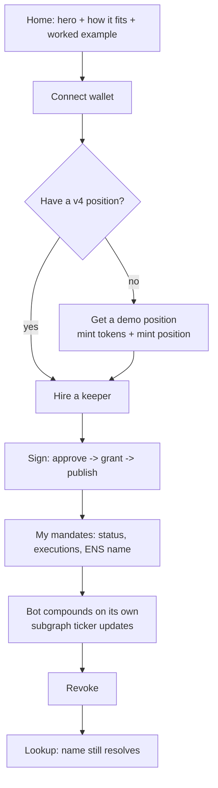

# Envoyage — from guided walkthrough to a working app

## Problem Frame

The web UI is a guided proof: real transactions, but arranged as a tutorial the viewer
follows. Judges score **Usability** on whether a person can *do the thing the product
is for*. Today nobody can hire a keeper, see their mandates, or revoke one from the
app — those live in Foundry scripts. The three sponsor integrations therefore read as
labels on buttons rather than as a system, and the author's own verdict is that the
project "does not look like a functioning app like Uniswap or Aave."

Envoyage is a **security primitive** (scoped, revocable permission for Uniswap v4
automation) with a reference keeper. The app must let an LP owner use the primitive
end-to-end and let anyone verify it — with the existing walkthrough kept as evidence.

## User Flow

## Requirements

**Home**
- R1. Opens with a one-sentence statement of what Envoyage is (a permission layer for Uniswap v4 automation), the hero treatment the author chose, and a diagram of how Owner / Envoyage / Uniswap / Bot / The Graph / ENS relate — before any number.
- R2. Shows mandate #1 as the live worked example — **mandate #1 is never revoked by any screen**; the Proof tab's revoke step targets a dedicated sacrificial mandate on a separate position. Shows #1 (scope, executions, ENS name) and the census: the count of live unbounded delegations (`setApprovalForAll` + single-position approvals) on Uniswap v4's PositionManager on Ethereum mainnet, beside the Sepolia count and the number that are scoped (Envoyage mandates). Each labelled by network. Reads independently; a failed read shows an error, never zero.
- R3. Navigation: Home · Hire a keeper · My mandates · Bot · Lookup · Proof — all six always visible. Wallet connect is persistent in the header and shows the connected account. Hire a keeper, My mandates and Bot render a single connect panel (headline, one Connect button, one line for no-injected-wallet) when no account is connected; Lookup and Proof work without a wallet. If the wallet leaves Sepolia after connecting, a persistent banner offers Switch and every write button is disabled. A connected wallet that already holds mandates lands on My mandates; otherwise on Home.

**Hire a keeper (owner)**
- R4. If the connected wallet holds no Uniswap v4 position in the demo pool, offer **Get a demo position**: a guided sequence (mint token A, mint token B, approve each to Permit2, approve each to the PositionManager, mint the position) with the same per-step pending / signed / failed / Retry model as R7. Steps already satisfied (tokens held, approvals present) are shown as done and skipped. The position is minted around the pool's *current* tick, not a fixed 1:1, so it earns fees. On completion the new position is selected in the Hire form. The prompt count and estimated cost are stated before the first signature. Must be usable by a stranger with only Sepolia ETH.
- R5. The form takes: position, keeper (pre-filled with Envoyage's reference bot, read-only in v0), fee cap in % of harvested fees (default 2%, hard max 10%), cooldown (default 5 min; the first compound is exempt), expiry (default 30 days). `feeRecipient` is the keeper address and `compoundAllowed` is always true in v0; both are shown in the preview, neither is editable. Positions are listed as rows (token id, pool pair, liquidity); a row with an active mandate is shown with an "already mandated — see My mandates" badge and is not selectable; the first eligible row is pre-selected. Position source: the demo helper's own mint event for positions it created, plus a paste-a-tokenId field validated with `ownerOf` and the demo pool key — v0 does not enumerate arbitrary v4 positions.
- R6. A live preview of the mandate as an instrument updates as the terms change, showing what the keeper may and may not do.
- R7. Submitting performs the signatures in sequence — approve the position to Envoyage, grant, then publish the ENS name — with each step's state visible (pending / signed / failed with a decoded reason). A failure at any step leaves the earlier steps' outcomes on screen and offers Retry for that step only. Re-submitting, or reloading the page with the same position selected, resumes from the first incomplete step (skips approve if the position is already approved to Envoyage; skips grant if `activeMandate[tokenId]` is set). If the position's name is already registered from an earlier, now-revoked mandate, a `retire(oldMandateId, positionId)` signature is inserted before publish and the user is told the old name is replaced. Before the first signature, the three transactions are estimated at current gas and the user is warned if the wallet cannot cover them.
- R8. On completion the screen shows the mandate number, the ENS name (`<position>.envoyage.eth`), and a link to My mandates.

**My mandates (owner)**
- R9. Lists every mandate granted by the connected wallet, from the subgraph: position, keeper, status, fee cap, executions to date, last execution, ENS name. A mandate with no published name shows a **Publish name** action (permissionless `publish(mandateId)`). With no mandates, the screen shows one line and a link to Hire a keeper.
- R10. Each active mandate has **Revoke** behind an inline confirm ("This ends mandate #N. Its name keeps resolving as a historical record. Revoke?"). The row shows "revoking — tx 0x…" until the subgraph reflects it, then REVOKED with the ENS name shown as still resolving and a **Retire name** action (permissionless, chain-guarded to revoked mandates) for owners who want the record gone. Disabled with a "switch to wallet X" hint when the connected account is not the grantor.
- R11. A live indicator. A mandate with zero executions shows "waiting for the bot — first compound expected within ~N min" with a live relative time and the same decoded pre-flight reason the Bot screen uses (fees accruing / cooldown remaining / no fees yet), so the owner sees *why* nothing has happened. When the bot compounds, the row updates within the indexer's latency and says so ("compounded — indexed at block N"). Pending states are shown as pending, never as empty.
- R12. On every screen, every chain read and every subgraph read loads independently; a failed source shows an inline error with Retry, never a zero or a blank. Pending is visibly pending.

**Bot (keeper, wallet-gated)**
- R13. Always in the nav. When the connected wallet is not named as keeper by any mandate it shows one explanatory panel and no actions. Otherwise it lists those mandates with a decoded pre-flight reason — `canCompound()` for the gate reasons (expired / cooldown remaining / owner changed / inactive) **plus** an `eth_call` simulation of `compound(id, minFee)` from the keeper account to surface `FeeBelowMinimum` / `ZeroLiquidityDelta` as "no fees yet" — and a **Compound** button per mandate.
- R14. Every revert is shown as a sentence, never as a bare "reverted". Buttons are disabled with a "switch to wallet X" hint when the connected account is not the required role.

**Lookup (anyone)**
- R15. One field, placeholder "1  or  38896.envoyage.eth"; a bare integer is a mandate number, anything else a name (`.envoyage.eth` appended if no dot; only `<positionId>.envoyage.eth` labels resolve in v0 and other names are rejected with a sentence). The initial state offers mandate #1 as a one-click example. Shows the scope **as resolved from the ENS resolver** (not from contract reads) beside the mandate's status and executions from the subgraph, each loading independently. When the subgraph status is not ACTIVE, the resolver card carries a banner: "mandate revoked at block N — this record is historical". Distinct states: name not found; name resolves but mandate not yet indexed; full card.

**Proof**
- R16. The existing walkthrough (old way / mandate / revoke, with the theft duel) is preserved unchanged under a Proof tab.

**Presentation**
- R17. Typeface: Averia Serif Libre (300/400/700 + italics). Theme: the 21st "amber-minimal" palette as tokens, honouring `prefers-color-scheme` for light and dark — no toggle control in v0. Hero: the 21st "hero-shutter-text" component, kept to one sentence above the diagram, honouring `prefers-reduced-motion`. Every text pair's contrast measured in both schemes. **Tier P2 with a time-box:** if a 21st component is not importable within 30 minutes, re-implement from its published code or fall back to a hand-written equivalent; the functional requirements are never delayed by presentation. The full success-criteria path is operable by keyboard; step completions and row updates are announced via a polite live region.
- R18. English only. Sponsor labels (Uniswap · The Graph · ENS) appear at the moment each is exercised, consistently styled.

## Success Criteria

- **Video path (must):** from the app alone, with the author's wallets, the full flow records cleanly: hire → watch the bot compound → revoke → lookup. The Proof tab is used only for the theft beat.
- **Stranger path (must, for Usability):** a stranger with a fresh Sepolia wallet and ~0.03 ETH (measured: ~1.7M gas across the path; the app warns if the balance is short at current gas) completes: get a demo position → hire the bot → watch a compound land in My mandates without pressing anything → revoke → look the name up. No script, no author present. Time to first compound is bounded and shown on screen.
- A judge can answer "where is Uniswap / The Graph / ENS used?" from the screens without reading docs.

## Scope Boundaries

- No keeper registry or marketplace; v0 has one keeper, Envoyage's bot. Say "registry is roadmap."
- No editing of terms after grant; revoke-and-regrant is the path.
- Only `compound` as a mandated action (contract v0). No rebalance, no exit.
- No dark/light toggle UI; scheme follows the OS.
- No charts or fee-over-time analytics.
- No mobile-first redesign; must not overflow at 375px, need not be optimised for it.

## Key Decisions

- **Fee supply is operational, not on-chain**: no new contract. A swap loop (round-trip swaps through the existing DemoSwapper, from the deployer key) runs next to the keeper on the author's VPS for the whole judging window. Time to first compound for a fresh mandate = swap cadence + keeper poll (30 s) + indexer lag, and the app states that bound. Chosen over a one-transaction faucet contract to keep the on-chain surface unchanged this close to submission.
- **Self-serve position minting is a guided sequence**: seven prompts, honestly shown with per-step state, rather than a helper contract. Demo tokens are publicly mintable.
- **Mandate #1 is permanent**: it is the worked example on Home and the Lookup default. The Proof tab revokes a dedicated sacrificial mandate (#2, on its own position, re-granted between takes).
- **Regrant on a published position retires the old name first**: `publish` is permissionless but the ENS label is not re-registrable while live, so the hire flow inserts `retire` (chain-guarded to revoked mandates) before `publish`.
- **Keeper is pre-filled and read-only**: the strongest demo beat is "grant, then watch it happen." Typing an arbitrary keeper turns the viewer into the bot and weakens the automation story.
- **Keeper screen kept, wallet-gated**: the author wants a manual compound available in the video outside the walkthrough.
- **Walkthrough survives as Proof**: it is evidence, and the theft duel has no equivalent in an app screen.
- **Primitive, not SDK**: the integration surface is a 3-function ABI plus an ENS name. No package is built.

## Dependencies / Assumptions

- The reference keeper AND the swap loop run continuously through judging on the author's VPS under a supervisor (pm2), from funded keys, with a low-balance alert. The keeper picks up newly granted mandates within ~2 minutes of indexing; R11's "watch it happen" beat depends on both processes. The keeper's fallback RPC list must not include 1rpc.io (returns empty results with HTTP 200).
- Keeper spend is bounded by the 5-minute default cooldown: ≈430k gas per compound per mandate per 5 min while fees keep arriving.
- `publish(mandateId)` is permissionless on the names contract — verified — so the owner's wallet can publish the ENS name in the grant flow.
- The subgraph filters `mandates` by `grantor` and `keeper` — verified in the schema.
- A public URL exists before the video (deployment is a separate task).

## Outstanding Questions

### Resolve Before Planning
- (none)

### Deferred to Planning
- [Affects R4][Technical] Minting around the current tick from the browser: read slot0, choose ±10 tickSpacing around it, fixed liquidity, generous amountMax — port of 01_DeployAndSeed's encoding to viem.
- [Affects R11][Technical] Swap-loop cadence vs MIN_FEE (1e12) and a fresh position's share of pool liquidity: what liquidity must the demo mint carry so one round trip clears ZeroLiquidityDelta?
- [Affects R11][Technical] Polling cadence vs. subgraph rate limits; whether to also watch chain events as the immediate signal and the subgraph as confirmation.
- [Affects R17][Needs research] Whether the 21st components are importable as source into a plain Vite/React app or must be re-implemented from their published code.

## Next Steps
→ /ce:plan for structured implementation planning
