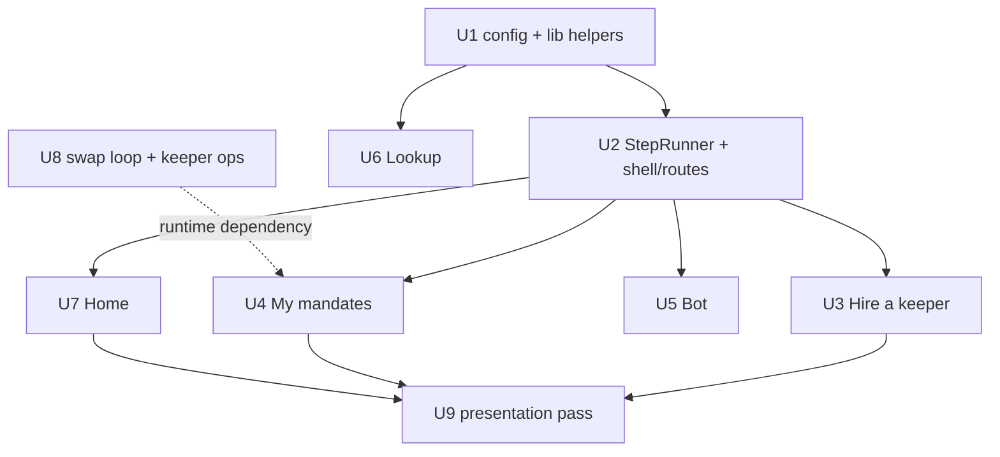

# feat: Envoyage app — hire, manage, verify

## Overview

Turn `web/` from a guided proof into a product: an LP owner hires the reference
keeper, watches it compound, revokes; anyone looks a mandate up by ENS name. The
walkthrough survives as a Proof tab. No contract changes. The on-chain data layer
(`web/src/lib/`) is reused, not rewritten. Fee supply for fresh positions is an
operational dependency (a swap loop next to the keeper), decided in the origin.

## Problem Frame

The current UI is a tutorial with real transactions; judges score Usability on
doing, not watching, and the sponsor integrations read as labels because the one
step where all three meet — granting a mandate — lives in a Foundry script.
(see origin: `docs/brainstorms/2026-09-10-envoyage-app-requirements.md`)

## Requirements Trace

R1–R18 of the origin, in full. Units below name the ones they advance. The two
success paths — **video path** (author's wallets, must) and **stranger path**
(fresh wallet, ~0.03 ETH, must) — are both satisfied by Units 1–7; Unit 8 makes
the stranger path's climax possible.

## Scope Boundaries

Carried from the origin: no keeper registry; no term editing; `compound` only;
no theme toggle; no charts; no mobile-first redesign; no new contract; no SDK.
Additionally: `web/src/lib/` is modified only where a unit says so (config
constants, one new read helper); `Proof` components keep their hooks and handlers.

## Context & Research

### Relevant Code and Patterns

- `web/src/lib/actions.ts` — `approvePosition`, `grant` (mandateId from the receipt
  log), `revoke`, `compound`, `ownerOf`, `positionLiquidity`, `positionCurrencies`.
  Every write is simulate-then-send; reuse verbatim.
- `web/src/ui/revert.ts` — decodes all 14 `envoyageAbi` errors at runtime with
  `toFunctionSelector`; every new button routes errors through it.
- `web/src/ui/kit.tsx` — `ActionButton` / `Outcome` / `TxState` lifecycle; the
  per-step model R4 and R7 need is this, repeated per step.
- `web/src/lib/session.tsx` — wallet context, account-change subscription, hash
  router (`useRoute`). Extend the router; do not replace it.
- `web/src/lib/graph.ts` — `gql` helper (throws on missing `data`), `fetchEnvoyage`,
  `fetchMainnetCensus`. Add filtered queries beside them.
- `web/src/lib/envoyage.ts` — `readMandate`, `readCanCompound`, `readEnsScope`
  (resolver-side), `verifyExecutionReceipts`, `namesAbi`/`resolverAbi`.
- `script/01_DeployAndSeed.s.sol` `_mintPosition` — the exact `MINT_POSITION +
  SETTLE_PAIR` encoding and the two-hop Permit2 approvals to port to viem.
- `script/02_GenerateFees.s.sol` + `script/demo/DemoSwapper.sol` — the swap loop's
  transaction shape.
- `src/ens/EnvoyageNames.sol` — `publish(mandateId)` and `retire(mandateId,
  positionId)`; both permissionless, `retire` reverts `MandateStillLive`.
- `subgraph/schema.graphql` — `Mandate.grantor`, `Mandate.keeper`,
  `Position.hasActiveMandate`, `Execution` — all the filters the lists need exist.
- `keeper/src/index.ts` — poll loop (`POLL_MS` 30 s) and `graph.ts` task source.

### Institutional Learnings

- `docs/solutions/` is empty. The session's own lessons that bind here: never
  hard-code selectors (four of six were wrong); a pending state must never render
  as an empty fact; `forge script --resume` clobbers deployment files; public RPCs
  return wrong-but-successful answers — read history from the subgraph, verify by
  receipt. All already encoded in `web/src/lib` and carried into the units.

### External References

- None needed; every layer has a direct local pattern.

## Key Technical Decisions

- **Screens are new files under `web/src/ui/`; the data layer is extended, not
  replaced.** The four load-bearing behaviours live in `lib/` and were verified
  live; rewriting them is the highest-risk thing the plan could do. Rationale:
  origin Key Decisions; today's three RPC failures.
- **Hash routes, one per screen** (`#/`, `#/hire`, `#/mandates`, `#/bot`,
  `#/lookup`, `#/demo`). Keeps the app a single static file for deployment.
- **Multi-step transaction sequences share one `StepRunner` model** — an ordered
  list of `{label, isDone(), run()}` executed with per-step `TxState`, resume from
  first not-done step, Retry re-runs one step. Used by both Get-a-demo-position
  (up to 7 steps) and Hire (3–4 steps). Rationale: R4 and R7 describe the same
  machine; one implementation, two step lists.
- **Position source is helper-mint memory + paste-a-tokenId**, not enumeration. The
  PositionManager is not enumerable and the subgraph has no Transfer handler; both
  fixes are out of scope this week. Minted tokenIds are stored per wallet in
  `localStorage`; any tokenId can be pasted and is validated by `ownerOf` and the
  demo pool key.
- **Demo mint is centred on the current tick.** Read `slot0`, snap to tick spacing,
  use ±10 spacings. A position minted at a fixed 1:1 in a pool that has drifted
  earns nothing, which would silently defeat R11.
- **Pre-flight = `canCompound()` + simulated `compound()`.** `canCompound` cannot
  see fee availability; the simulation surfaces `FeeBelowMinimum` /
  `ZeroLiquidityDelta` as "no fees yet". One helper, used by Bot, My mandates and
  Hire's preview.
- **Lookup cross-checks resolver against subgraph.** ENS records survive revoke by
  design; without the subgraph status beside them a revoked scope reads as live.
- **Mandate #1 is never revoked by the app; Proof revokes a sacrificial mandate #2**
  whose id comes from config, granted by script on its own position.
- **Fee supply is a swap loop process, not a contract.** Origin decision. A
  `keeper/src/swap-loop.ts` broadcasts a DemoSwapper round trip on a cadence from
  the deployer key; runs under pm2 beside the keeper.
- **Presentation (R17) is tier P2 with a 30-minute time-box per component**, applied
  as tokens on top of the existing stylesheet. Fonts via Google Fonts `@import`
  with a serif fallback stack; theme as `:root` / `prefers-color-scheme` tokens.

## Open Questions

### Resolved During Planning

- Position enumeration → helper memory + paste, validated on chain (see decisions).
- "No fees yet" source → simulated `compound` in the pre-flight helper.
- Regrant on a published position → `retire` inserted before `publish` when the
  registry owner of the label is non-zero and the subgraph says the old mandate is
  revoked.
- Where the demo pool key lives → `web/src/lib/config.ts` (`DEMO_POOL`: token0,
  token1, fee 10000, tickSpacing 200, hooks 0), copied from `deployments/sepolia.json`.

### Deferred to Implementation

- Exact liquidity for the demo mint so one swap round trip clears
  `ZeroLiquidityDelta`: start at the deploy script's 100e18-equivalent scaled to the
  wallet's minted balance; tune after the first live mint.
- Swap-loop cadence: start at one round trip every 2 minutes; adjust from observed
  keeper behaviour and deployer balance burn.
- Whether the 21st `hero-shutter-text` is importable as source or re-implemented:
  30-minute time-box, then fallback (R17).
- Gas estimate for the pre-signature warning: sum of `estimateGas` per step at
  current `gasPrice`; exact multiplier chosen when observed.

## High-Level Technical Design

> *This illustrates the intended approach and is directional guidance for review, not implementation specification. The implementing agent should treat it as context, not code to reproduce.*

```
StepRunner(steps: [{label, isDone: () => Promise<bool>, run: () => Promise<hash>}])
  on start / on retry(i):
    for each step from first !isDone():
      state[i] = running → run() → done | failed(decoded reason); stop on failed
  resume: same loop; isDone() skips satisfied steps (approval present, mandate exists)

Get-a-demo-position steps:  mintA, mintB, approveA→Permit2, approveB→Permit2,
                            permit2A→POSM, permit2B→POSM, mintPosition(currentTick±10)
Hire steps:                 [retireOld?] approve(Envoyage), grant, publish

Preflight(mandateId, keeper) → {gate: canCompound(), fees: simulate compound()}
                             → one sentence via revert.ts; used by Bot, My mandates, Hire preview

Lookup(input) → mandateId | positionId
   resolver: nodeFor(positionId) → text records        (independent load)
   subgraph: mandate(id) status, executions            (independent load)
   banner when subgraph.status != ACTIVE
```

## Implementation Units



- [ ] **Unit 1: Config, pool key, and lib helpers**

**Goal:** Everything the screens read or write exists in `lib/` with the same
guarantees as the existing helpers.

**Requirements:** R4, R5, R7, R9, R10, R13, R15

**Dependencies:** None

**Files:**
- Modify: `web/src/lib/config.ts` (add `DEMO_POOL` key, `SACRIFICIAL_MANDATE_ID`, `PERMIT2`)
- Modify: `web/src/lib/graph.ts` (add `fetchMandatesByGrantor`, `fetchMandatesByKeeper`, `fetchMandate(id)`)
- Modify: `web/src/lib/actions.ts` (add `publishName`, `retireName`, `mintDemoTokens`, `approveTokenToPermit2`, `approvePermit2ToPosm`, `mintDemoPosition`, `preflight`)
- Modify: `web/src/lib/envoyage.ts` (add `readNameOwner(positionId)` via the registry)
- Test: `web/src/lib/__tests__/preflight.test.ts`, `web/src/lib/__tests__/lookupParse.test.ts` (vitest; add the dev dependency)

**Approach:**
- Port `_mintPosition` from `script/01_DeployAndSeed.s.sol` to viem: read `slot0`
  for the current tick, snap to `tickSpacing`, ±10 spacings, fixed liquidity,
  `type(uint128).max` amountMax. Encode with `encodeAbiParameters`/`encodePacked`
  exactly as `buildTheftActions` already does.
- `preflight` combines `readCanCompound` with `simulateContract(compound)` from the
  keeper account and returns a decoded sentence via `revert.ts`.
- Every new write follows the existing simulate-then-`writeContract` shape and
  returns the hash; receipts are awaited by the caller.

**Patterns to follow:** `actions.ts` (`grant`, `stealViaEnvoyage`), `graph.ts` (`gql`, `fetchEnvoyage`), `envoyage.ts` (`readEnsScope`).

**Test scenarios:**
- Happy path: `preflight` on a mandate with fees and an eligible keeper → "may act".
- Happy path: `preflight` where `canCompound` is 0x0 but simulation reverts `ZeroLiquidityDelta` → "no fees yet" (this is the case `canCompound` alone gets wrong).
- Edge: `preflight` on cooldown → sentence contains remaining seconds computed from `lastCall + minInterval`.
- Error: `preflight` when both reads fail → throws; never returns "may act".
- Happy path: lookup parser: `"1"` → mandate 1; `"38896.envoyage.eth"` → position 38896; `"38896"` with a dot-less name flag → name; `"alice.envoyage.eth"` → rejected with a sentence.
- Integration (manual, recorded in Verification): `mintDemoPosition` against a fork mints in range at the current tick.

**Verification:** helpers compile; unit tests pass; a fork run of the mint sequence produces a position whose tick range contains the current tick.

- [ ] **Unit 2: StepRunner, shell, routes, connect states**

**Goal:** The app shell with six routes, persistent wallet bar, connect panel for
gated screens, wrong-network banner, and the shared multi-step transaction runner.

**Requirements:** R3, R4 (model), R7 (model), R12, R14

**Dependencies:** Unit 1

**Files:**
- Create: `web/src/ui/StepRunner.tsx`, `web/src/ui/ConnectPanel.tsx`, `web/src/ui/NetworkBanner.tsx`, `web/src/ui/Shell.tsx`
- Modify: `web/src/App.tsx` (route table), `web/src/lib/session.tsx` (expose chainId + `switchToSepolia`)
- Test: `web/src/ui/__tests__/StepRunner.test.tsx`

**Approach:**
- `StepRunner` takes an ordered step list; renders one row per step with `TxState`;
  starts from the first step whose `isDone()` is false; Retry re-runs only that step;
  failure stops the sequence and decodes via `revert.ts`.
- Route table maps `#/`, `#/hire`, `#/mandates`, `#/bot`, `#/lookup`, `#/demo`.
  Connected wallet with ≥1 mandate lands on `#/mandates` (one subgraph read).
- `ConnectPanel` is the only thing gated screens render without an account.

**Patterns to follow:** `kit.tsx` (`ActionButton`, `Outcome`), `session.tsx` (`useRoute`), `WalletBar.tsx`.

**Test scenarios:**
- Happy path: three steps all not-done → runs in order, each transitions running → done.
- Happy path: step 1 `isDone()` true → runner starts at step 2 and marks step 1 done without running it.
- Error path: step 2 `run()` throws a revert → step 2 shows the decoded sentence, step 3 never runs, Retry re-invokes only step 2.
- Edge: account changes mid-sequence → runner halts and shows "account changed; reconnect to resume".
- Integration: with no injected wallet, `#/hire` renders `ConnectPanel` and the nav still shows all six items.

**Verification:** all six routes render; gated routes show the connect panel; the network banner appears when the wallet is on another chain.

- [ ] **Unit 3: Hire a keeper**

**Goal:** Owner gets a position (guided), sets terms, previews the instrument, signs
approve → grant → publish (with `retire` inserted when needed), lands on completion.

**Requirements:** R4, R5, R6, R7, R8

**Dependencies:** Units 1, 2

**Files:**
- Create: `web/src/ui/Hire.tsx`, `web/src/ui/PositionPicker.tsx`, `web/src/ui/MandatePreview.tsx`, `web/src/ui/GetDemoPosition.tsx`
- Test: `web/src/ui/__tests__/hireSteps.test.ts` (step-list construction and isDone logic)

**Approach:**
- `PositionPicker` merges `localStorage` minted ids with a paste field; each row is
  validated (`ownerOf == account`, pool key matches) and checked against
  `activeMandate(tokenId)` — mandated rows are badged and unselectable.
- Hire step list is built from state: `[retire if name owner != 0 && old mandate
  revoked] → approve (skip if `getApproved == ENVOYAGE`) → grant (skip if
  `activeMandate != 0`) → publish (skip if name owner == grantor's expected)`.
- `MandatePreview` renders the same instrument the Lookup card uses: may (compound),
  may not (withdraw, redirect, swap, act after sale, change terms), cap, cooldown,
  expiry as absolute date, keeper, recipient, the name it will get.
- Pre-signature: estimate the pending steps at current gas; warn if balance is short.

**Patterns to follow:** existing instrument markup in `Overview.tsx` (permitted / withheld lists), `Theft.tsx` outcome rendering.

**Test scenarios:**
- Happy path: fresh position, no name → steps = [approve, grant, publish].
- Happy path: position already approved to Envoyage → steps = [grant, publish], approve shown done.
- Happy path: previous mandate revoked and name still registered → steps = [retire, approve, grant, publish].
- Edge: position with an active mandate → row unselectable with the badge; submit disabled.
- Edge: fee cap input 12% → clamped/rejected at 10% with a message; cooldown 0 accepted (contract allows it).
- Error path: grant reverts `NotPositionOwner` (account switched) → decoded sentence, publish never runs.
- Integration: completion screen shows mandate id from the `MandateGranted` log and `<position>.envoyage.eth`; My mandates link resolves to a list containing it.

**Verification:** on a fork, the full sequence lands and `readEnsScope` returns the terms just set.

- [ ] **Unit 4: My mandates**

**Goal:** The owner's list with live status, waiting-for-bot copy, revoke with
confirm, publish-name and retire-name actions.

**Requirements:** R9, R10, R11, R12, R14

**Dependencies:** Units 1, 2

**Files:**
- Create: `web/src/ui/MyMandates.tsx`, `web/src/ui/MandateRow.tsx`, `web/src/ui/useLiveMandate.ts`
- Test: `web/src/ui/__tests__/mandateRow.test.tsx`

**Approach:**
- Rows from `fetchMandatesByGrantor(account)`; each row also reads chain state
  independently (`readMandate`, `preflight`) so a stalled indexer never blanks it.
- `useLiveMandate` polls the subgraph every 5 s while a row has an in-flight
  expectation (granted <10 min ago with 0 executions, or a revoke pending) and
  stops when the count rises / status flips. Waiting copy shows the pre-flight
  reason and a relative "expected within ~N min" bound computed from swap cadence
  + keeper poll + indexer lag constants in config.
- Revoke: inline confirm → `revoke` → row shows "revoking — tx" until the subgraph
  status is REVOKED → Retire name action appears.

**Patterns to follow:** Overview's subgraph-poll-after-compound logic; `KeeperActs.tsx` for decoded revert display.

**Test scenarios:**
- Happy path: two mandates for the account → two rows with status, cap, executions, name.
- Happy path: row with 0 executions and pre-flight "no fees yet" → waiting copy names the reason.
- Happy path: subgraph executionCount rises during polling → row updates to "compounded — indexed at block N" and polling stops.
- Edge: no mandates → single line + Hire link; no blank list.
- Edge: mandate without a published name → Publish name action; after it lands the name appears.
- Error path: subgraph query fails → inline error with Retry; chain-read fields on the row still render.
- Error path: revoke from a non-grantor account → button disabled with the switch hint (no transaction sent).
- Integration: revoke lands → status REVOKED, name still resolves (resolver read), Retire name visible.

**Verification:** with the author's wallet the row for mandate #1 shows live data; a revoked sacrificial mandate shows REVOKED with the retire action.

- [ ] **Unit 5: Bot**

**Goal:** Keeper-gated list with pre-flight sentences and Compound per mandate;
explanatory panel for non-keepers.

**Requirements:** R13, R14

**Dependencies:** Units 1, 2

**Files:**
- Create: `web/src/ui/Bot.tsx`
- Modify: `web/src/ui/KeeperActs.tsx` (extract the compound handler into a shared hook if not already reusable)
- Test: `web/src/ui/__tests__/bot.test.tsx`

**Approach:** rows from `fetchMandatesByKeeper(account)`; each row shows `preflight` and a Compound button gated on `account == keeper`; results via the existing outcome rendering. Non-keeper accounts see one panel.

**Test scenarios:**
- Happy path: keeper account with one mandate → one row, pre-flight sentence, enabled Compound.
- Edge: connected account is not a keeper → explanatory panel, no rows, no buttons.
- Error path: Compound reverts `CooldownActive` → sentence with seconds remaining, button re-enabled.
- Integration: successful compound → pre-flight refreshes to the cooldown sentence.

**Verification:** with the keeper key connected the row for #1 compounds when fees exist and explains itself when they do not.

- [ ] **Unit 6: Lookup**

**Goal:** Name or number → resolver-side scope beside subgraph status, with the
revoked banner and the three distinct not-found states.

**Requirements:** R15, R12

**Dependencies:** Unit 1

**Files:**
- Create: `web/src/ui/Lookup.tsx`
- Test: `web/src/ui/__tests__/lookup.test.tsx`

**Approach:** parse input (Unit 1 helper); resolver card via `readEnsScope(positionId)`; subgraph card via `fetchMandate(id)`; both load independently. Number input resolves the positionId from the subgraph (revoke deletes storage, so the contract cannot answer). Banner when status ≠ ACTIVE.

**Test scenarios:**
- Happy path: `1` → both cards populated for mandate #1.
- Happy path: `38896.envoyage.eth` → resolver card; subgraph card by position.
- Edge: name resolves, subgraph has no mandate yet → "resolves; not yet indexed".
- Edge: number of a revoked mandate → subgraph card REVOKED, resolver card with the historical banner.
- Error path: unknown name → "name not found", no zeroes.
- Error path: subgraph down → resolver card still renders; subgraph card shows error + Retry.

**Verification:** the four states render distinctly; mandate #1 is the one-click example.

- [ ] **Unit 7: Home**

**Goal:** One sentence, the diagram, mandate #1 as worked example, census by network.

**Requirements:** R1, R2, R3, R12

**Dependencies:** Unit 2

**Files:**
- Create: `web/src/ui/Home.tsx`, `web/src/ui/FitDiagram.tsx` (SVG of `docs/submission/HOW-IT-FITS.md`)
- Modify: `web/src/ui/Overview.tsx` (becomes the worked-example + census component, trimmed)

**Approach:** hero is one sentence (shutter treatment only if R17's time-box allows), diagram directly beneath, then the worked example and the census, both reading independently with error states. Connected wallets with mandates are redirected to `#/mandates` by the shell.

**Test scenarios:**
- Happy path: page renders the diagram and worked example with live data.
- Error path: mainnet census read fails → inline error; the rest of the page unaffected.
- Edge: the worked example must reference `DEMO_MANDATE_ID` only; never the sacrificial id.

**Verification:** a screenshot at 1280 shows sentence → diagram → example → census, in that order.

- [ ] **Unit 8: Swap loop and keeper operations**

**Goal:** Fees accrue on the demo pool continuously and the keeper runs unattended
through judging; the app's "expected within ~N min" bound is true.

**Requirements:** R11 (dependency), origin Dependencies

**Dependencies:** none (runs in parallel with Units 3–7)

**Files:**
- Create: `keeper/src/swap-loop.ts`, `keeper/ecosystem.config.cjs` (pm2: keeper + swap loop), `keeper/README.md` (ops section)
- Modify: `keeper/src/index.ts` (remove 1rpc.io from the fallback list; add a low-balance warning), `keeper/package.json` (script)
- Modify: `script/03_GrantMandate.s.sol` or a new `script/09_GrantSacrificial.s.sol` (grant mandate #2 on a new position for Proof)
- Test: `keeper/src/__tests__/swapLoop.test.ts` (cadence and stop conditions, with the send mocked)

**Approach:** the loop broadcasts one DemoSwapper round trip every N minutes from the deployer key, logs each, and pauses when the deployer balance falls below a floor. pm2 keeps both processes alive on the author's VPS.

**Execution note:** Execution target: coordinator (author's VPS access; not the UI worker).

**Test scenarios:**
- Happy path: tick → two swaps sent (zeroForOne then back), logged with hashes.
- Edge: balance below floor → tick skipped with a warning; no send.
- Error path: RPC error on send → logged, loop continues on next tick.

**Verification:** on the VPS, `pm2 ls` shows both processes up; a fresh mandate granted from the app is compounded within the stated bound; `deployments/sepolia.json` records the sacrificial mandate id.

- [ ] **Unit 9: Presentation pass (P2, time-boxed)**

**Goal:** Averia Serif Libre, amber-minimal tokens for light and dark, the shutter
hero, contrast measured in both schemes, keyboard operability, reduced motion.

**Requirements:** R17, R18

**Dependencies:** Units 3, 4, 7 (apply to finished screens)

**Files:**
- Modify: `web/src/styles.css` (font import, token layer, `prefers-color-scheme` block), `web/index.html` (font preconnect)
- Modify: `web/scripts/contrast-pairs.sh` (both schemes)
- Create: `web/src/ui/ShutterHero.tsx` only if importable/re-implementable within the time-box

**Approach:** tokens layered over the existing stylesheet, no rewrite; sponsor labels one shared component. Thirty-minute time-box per 21st component, then fallback.

**Test expectation:** none — styling; verified by the contrast script passing in both schemes and a keyboard walk of the stranger path.

**Verification:** contrast script reports every pair passing in light and dark; the stranger path is completable by keyboard; hero honours reduced motion.

## System-Wide Impact

- **Interaction graph:** the shell's landing redirect reads the subgraph on connect;
  My mandates and Bot both poll; Hire writes to PositionManager, Envoyage and
  EnvoyageNames. All go through existing `lib/` helpers.
- **Error propagation:** every write decodes via `revert.ts`; every read pair
  (chain, subgraph) has its own error state (R12).
- **State lifecycle risks:** partial Hire sequences — mitigated by `isDone()` resume;
  minted-position memory in `localStorage` is per-browser (acceptable, paste covers it).
- **API surface parity:** the Proof tab keeps its own wallet/compound paths; it must
  target `SACRIFICIAL_MANDATE_ID`, never #1.
- **Integration coverage:** grant → subgraph row → keeper pickup → compound →
  row update is the one path unit tests cannot prove; it is verified live in Unit 8.
- **Unchanged invariants:** contracts, subgraph schema, ENS names contract, the
  keeper's task source, and every existing `lib/` function signature.

## Risks & Dependencies

| Risk | Mitigation |
|------|------------|
| Fresh position earns no fees (P0 from review) | Unit 8 swap loop; waiting copy names "no fees yet"; bound shown on screen |
| Keeper or swap loop dies during judging | pm2 restart policy; low-balance warnings; coordinator checks before recording |
| Mint out of range if the pool drifts | mint centred on the current tick (Unit 1) |
| Regrant fails at publish | retire inserted when the label is registered and the old mandate is revoked |
| Proof tab revokes mandate #1 | sacrificial id in config; Proof retargeted |
| Public RPC truncation | history from subgraph, receipts for verification (already in lib) |
| R17 eats functional time | tier P2, 30-minute time-box per component, fallback defined |
| Gas spikes strand the stranger | pre-signature estimate + warning; ~0.03 ETH stated |

## Documentation / Operational Notes

- `keeper/README.md` gains the ops runbook (pm2, env, balances).
- `docs/SEPOLIA.md` records the sacrificial mandate and position.
- `docs/HANDOFF-UI.md` is superseded by this plan for the app work; keep it for the
  design rationale.
- Deployment to a public URL (Cloudflare Pages) is a separate task; keys must be
  domain-restricted first.

## Sources & References

- **Origin document:** `docs/brainstorms/2026-09-10-envoyage-app-requirements.md`
- Related code: `web/src/lib/*`, `web/src/ui/*`, `script/01_DeployAndSeed.s.sol`, `script/demo/DemoSwapper.sol`, `src/ens/EnvoyageNames.sol`, `subgraph/schema.graphql`, `keeper/src/index.ts`
- Related docs: `docs/submission/HOW-IT-FITS.md`, `docs/HANDOFF-UI.md`
